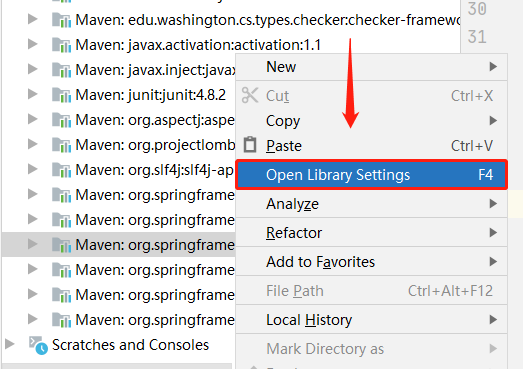
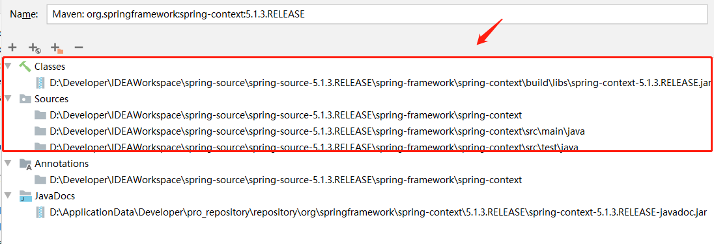

#  Spring Framework intensive reading

## 说明
spring源码阅读，理解spring各个模块的实现原理，实现流程。源码中添加了大量的中文注释（关键模块都有，很详细）。

## Spring源码版本
    v5.1.3RELEASE

## 源码下载及编译

1. 源码下载：git clone --branch v5.1.3.RELEASE https://gitee.com/wanglizhi00/spring-framework.git

2. 源码编译：
    
        到下载的spring源码路径执行gradle命令 .\gradlew :spring-oxm:compileTestJava

3. 使用IDEA打开项目后，如果在IDEA中使用gradle重新编译模块乱码，添加以下JVM参数  
        
        -Dfile.encoding=UTF-8

## 源码引入到maven项目library中

## 

## 

## 概览

1.spring上下文初始化核心流程（refresh方法）
        
    1. prepareRefresh(); refresh之前的准备工作，内部调用逻辑已注释
    2. obtainFreshBeanFactory();重点方法：BeanFactory创建，XMl配置文件解析，
      BeanDefinition封装
        1.SPi（Service Provider Interface）思想，注册解析类
        2.NamespaceHandler init() decorate() parse() 处理默认及自定义标签解析
        3.BeanDefinitionParser，由NamespaceHandler.init()注册，负责标签属性解析
            1.PropertyPlaceholderBeanDefinitionParser 
            2.PropertyOverrideBeanDefinitionParser 
            3.AnnotationConfigBeanDefinitionParser 
            4.ComponentScanBeanDefinitionParser 重点关注 
            5.SpringConfiguredBeanDefinitionParser 
              ...
        4.委托模式
        5.源码中类似路径正则解析的建议不看，调用链太深，容易陷进去出不来。
    3. prepareBeanFactory(beanFactory);注册一些对事件、监听器等内置功能的支持
    4. postProcessBeanFactory(beanFactory);钩子方法，BeanFactory创建后，
    对BeanFactory的自定义操作。
    5. invokeBeanFactoryPostProcessors(beanFactory);
    重点方法：这里调用了postProcessBeanDefinitionRegistry(registry)、
        postProcessBeanFactory(registry);springboot中很多激活自动配置的
        注解都是通过这里导入的。
        重点关注：AnnotationConfigUtils.registerAnnotationConfigProcessors，
        注册的内置的BeanDefinitionRegistryPostProcess
            1.ConfigurationClassPostProcessor，内部包含@Configuration、
                @Bean、@Import、@ImportSource、@Component、@ComponentScan、
                @PropertySources等注解的支持 
    6. registerBeanPostProcessors(beanFactory);重点方法：从beanFactory
    中获取所有的BeanPostProcessor，优先进行getBean操作，实例化
    接口及子接口
        BeanPostProcess 定义了类初始化之前、之后的方法回调
        InstantiationAwareBeanPostProcessor 定义了类实例化之前、之后、
        依赖注入的方法回调
            SmartInstantiationAwareBeanPostProcessor定义了获取早期
            Bean引用、获取候选构造函数方法
            重点关注：
                RequiredAnnotationBeanPostProcessor
                AutowiredAnnotationBeanPostProcessor
                CommonAnnotationBeanPostProcessor
            MergedBeanDefinitionPostProcessor 定义了类实例化之后，依赖注入之前
            的的方法回调
            DestructionAwareBeanPostProcessor 定义了bean销毁之前的方法回调
                InitDestroyAnnotationBeanPostProcessor
    7. initMessageSource();国际化支持，不常用，未加注释。	
    8. initApplicationEventMulticaster();初始化ApplicationEventMulticaster。 
    如果上下文中未定义，
      则使用SimpleApplicationEventMulticaster。		
    9. onRefresh();钩子方法，springBoot中的嵌入式tomcat就是通过此方法实现的
    10. registerListeners();监听器注册
    11. finishBeanFactoryInitialization(beanFactory);重点方法：完成容器中
    bean的实例化，及代理的生成等操作。
        这里面包含内容getBean、依赖注入、生成代理等。具体看代码。
    12. finishRefresh();完成此上下文的刷新，调用LifecycleProcessor的onRefresh
    方法并发布

2.bean实例化

    所有单例bean实例化后回调接口SmartInitializingSingleton。Bean实例化流程：
    getBean 
    -> doGetBean 
    -> getSingleton() 
    -> getSingleton 
        -> singletonFactory.getObject()
            -> createBean
                -> resolveBeforeInstantiation 给机会返回代理
                    -> applyBeanPostProcessorsBeforeInstantiation 
                    -> applyBeanPostProcessorsAfterInitialization
                -> doCreateBean
                    -> createBeanInstance 
                    -> applyMergedBeanDefinitionPostProcessors
                    -> addSingletonFactory
                    -> populateBean依赖注入 
                        -> postProcessProperties 属性注入 spring5.1版本及之后
                            -> findAutowiringMetadata封装需要注入的属性 
                            -> inject 
                            -> element.inject(InjectedElement)
                            -> (AutowiredFieldElement/AutowiredMethodElement)
                        -> postProcessPropertyValues属性注入spring5.1版本之前
                        -> applyPropertyValues
                    -> initializeBean
                        -> applyBeanPostProcessorsBeforeInitialization
                        -> invokeInitMethods
                        -> applyBeanPostProcessorsAfterInitializationAOP入口
            ->addSingleton()添加一级缓存
    -> getObjectForBeanInstance
    如果实力是FactoryBean类型，调用factory.getObject();
    最终返回这个方法返回的实例.如果要获取源实例，需要在beanName前加&符号
    
3.BeanPostProcessor扩展 --> AOP实现逻辑
        
    1.AOP的生成：
        -> AbstractAutoProxyCreator.postProcessAfterInitialization 
        -> wrapIfNecessary
            -> getAdvicesAndAdvisorsForBean 获取切面
                -> findEligibleAdvisors
                    -> findCandidateAdvisors
                        -> super.findCandidateAdvisors()
                            -> findAdvisorBeans
                        -> buildAspectJAdvisors
                            -> isAspect 
                            -> getAdvisors
                                -> getAdvisorMethods
                                -> getAdvisor
                                    -> getPointcut 
                                    -> new 
                                    InstantiationModelAwarePointcutAdvisorImpl
            -> createProxy
                -> buildAdvisors 构建切面（将是MethodInterceptor的对象
                包装为Advisor，策略模式，消除执行链时的ifelse）
                    —> resolveInterceptorNames（事务增强会在这里面）
                -> getProxy生成代理对象
                    -> createAopProxy(JdkDynamicAopProxy/ObjenesisCglibAopProxy)
                    -> getProxy
                        -> if(JdkDynamicAopProxy) 
                            -> Proxy.newProxyInstance    
                        -> if(ObjenesisCglibAopProxy) 
                            -> createProxyClassAndInstance
                            -> newInstance ->setCallbacks
    2.AOP执行链的执行（以JDK动态代理为例）：
        JdkDynamicAopProxy.invoke
        -> getInterceptorsAndDynamicInterceptionAdvice
        -> invocation = new ReflectiveMethodInvocation
        -> invocation.proceed()
            -> currentInterceptorIndex未达到执行链末尾
            -> 获取切面是InterceptorAndDynamicMethodMatcher
            -> dm.interceptor.invoke(this);执行切面增强，
            并将自身作为参数传递，火炬传递。比如around中会议JoinPoint为参数，
            内部调用时又会调用到proceed方法
            -> currentInterceptorIndex达到执行链末尾
            -> invokeJoinpoint
            -> 有火炬传递的，向上跳出，执行后置增强并返回。
            
4.BeanPostProcessor扩展 --> 事务实现逻辑，传播行为原理
        
    1.入口：EnableTransactionManagement
    -> @Import(TransactionManagementConfigurationSelector.class) 
    -> ProxyTransactionManagementConfiguration
    -> 包含一系列的@Bean标识的方法，其中transactionAdvisor
    返回对应BeanFactoryTransactionAttributeSourceAdvisor，
    这个类是事务增强类。
    2.事务属性搜集：getTransactionAttribute
    -> computeTransactionAttribute 
    -> findTransactionAttribute 
    -> determineTransactionAttribute 
    -> parseTransactionAnnotation 
    -> 查找Transactional注解 
    -> parseTransactionAnnotation 
    -> AnnotationAttributes转换为TransactionAttribute
    3.事务拦截器执行流程：TransactionInterceptor，getBean中AOP生成代理对象时，
    会将这个方法拦截器加入执行链中
        invoke -> invokeWithinTransaction(invocation.getMethod(), targetClass, 
        invocation::proceed(这个是执行链的回调函数))
            -> determineTransactionManager 
            -> createTransactionIfNecessary
                -> getTransaction 
                    -> isExistingTransaction 
                    -> handleExistingTransaction
                    -> definition.getPropagationBehavior()
                    ==reauired、requiredNew、nested
                    -> doBegin
                -> prepareTransactionInfo
            -> proceedWithInvocation 
            -> (completeTransactionAfterThrowing 
            -> cleanupTransactionInfo)
            /(cleanupTransactionInfo -> commitTransactionAfterReturning)
        事务的执行流程不好描述，具体可看源码中的注释，很详细。
5.MVC中DispatcherServlet核心流程：HanlderMapping、HanlderAdapter扩展等。
6.更多知识点见源码中注释，上面列举的，没列举的都有。很详细。